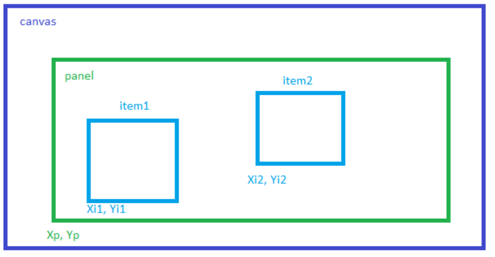
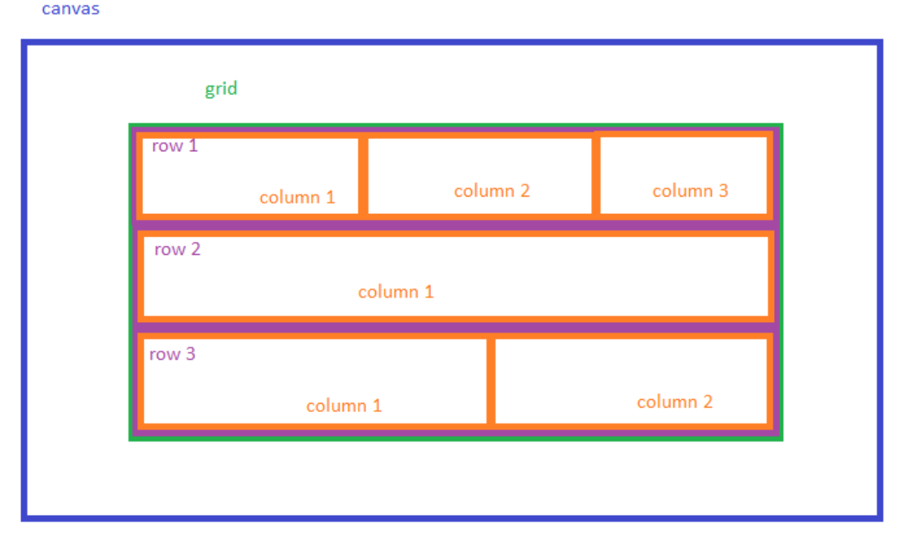
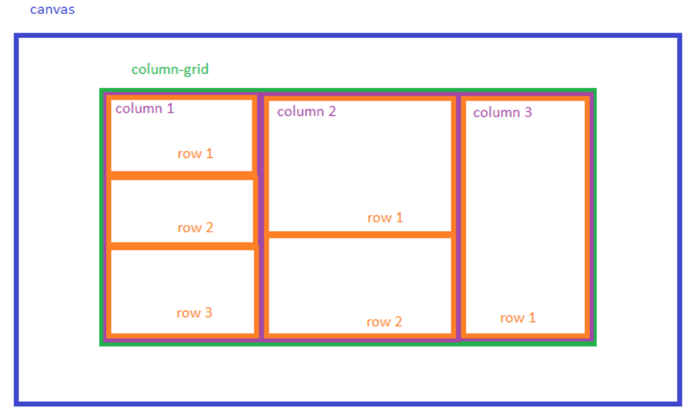
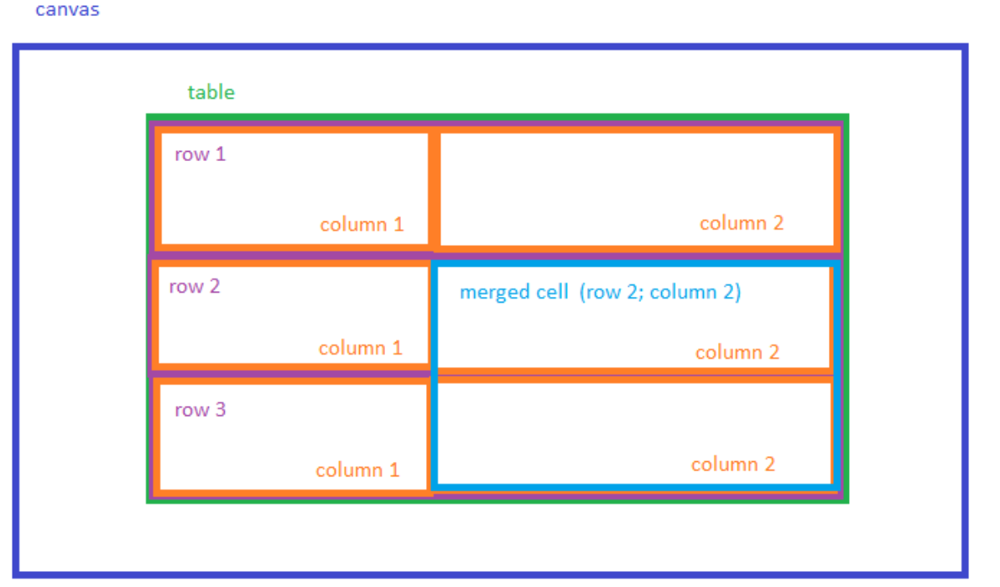

# Контейнеры

Контейнеры &mdash; элементы графического полотна, определяющие правила размещения, положение и размер графика на графическом полотне.
Контейнеры обладают свойством вложенности.
## Panel
`Panel` позволяет располагать графические объекты с заданными координатами внутри одной панели.



Пример конфигурации графического полотна:
```json showLineNumbers {9}
{
    "data": {...},
    "view": {
        "items": [
            {
                "type": "canvas",
                "items": [
                    {
                        "type": "panel",
                        "items": [
                            {
                                "type": "graph",
                                "x": "10 px",
                                "y": "10 px",
                                "height": "200 px",
                                "width": "500 px",
                                ...
                            },
                            {
                                "type": "graph",
                                "x": "70 px",
                                "y": "70 px",
                                "height": "200 px",
                                "width": "500 px",
                                ...
                            },
                        ]
                    }
                ]
            }
        ]
    }
}
```
На строчке 9 определяется объект-контейнер `panel`. Графики, определенные внутри свойства **items** соответствующего объекта с **type** `panel`, будут рисоваться внутри контейнера
`Panel`. Для того, чтобы задать графику координаты необходимо определить у объекта графика свойства **x** и **y**. Заданные координаты определяют позицию левого нижнего угла
графика. Также, необходимо определить такие свойства объекта графика, как: **height**, **width**. Данные свойства отвечают за высоту и ширину соответствующего графика.



  [Пример](/examples/panel) отображения сигналов с применением контейнера `Panel`.



## Grid
`Grid` представляет таблицу, состоящую из произвольного количества рядов. Ряды могут содержать произвольное количество столбцов.
Каждая ячейка является контейнером [panel](#panel).



Пример неполной конфигурации графического полотна:
```json showLineNumbers {9}
{
    "data": {...},
    "view": {
        "items": [
            {
                "type": "canvas",
                "items": [
                    {
                        "type": "grid",
                        "rowsSpace": "5 px", // Расстояние между рядами
                        "rows": [] // Содержит описания объектов-рядов.
                    }
                ]
            }
        ]
    }
}
```
На строчке 9 определяется объект-контейнер `grid`. В объекте-контейнере `grid` определяются такие свойства, как:

| Название | Тип | Значение поумолчанию | Описание |
| :---: | :---: | :---: | --- |
| `rowsSpace` | **string** | 0px | Расстояние между рядами. |
| `rows` | **Array\<object\>** | &mdash; | Содержит описания рядов. |

Пример определение объекта-ряда:
```json
{
    "rows": [
        {
            "height": "33 %", // Высота ряда от высоты контейнера
            "columnSpace": "5 px", // Расстояние между столбцами ряда
            "columns": [
                {
                    "width": "50%", // Ширина столбца от ширины контейнера
                    "item": { "type": "graph", ... }
                }
            ]
        }
    ]
}
```
При определении объекта-ряда необходимо определить такие свойства, как:

| Название | Тип | Значение поумолчанию | Описание |
| :---: | :---: | :---: | --- |
| `height` | **string** | 100 % | Высота ряда от высоты контейнера. |
| `columnSpace` | **number** | 0 px | Расстояние между столбцами ряда. |
| `columns` | **Array\<object\>** | &mdash; | содержит описания объектов-столбцов соответствующего ряда. |

### columns

| Название | Тип | Значение поумолчанию | Описание |
| :---: | :---: | :---: | --- |
| `width` | **string** | 100 % | Ширина объекта-столбца. |
| `item` | **Array\<object\>** | &mdash; | Содержит определение графика. |



  [Пример](/examples/grid) отображения сигналов с применением контейнера `Grid`.



## Column-grid
`Column-grid` представляет таблицу, состоящую из произвольного количества столбцов. Столбцы могут содержать произвольное количество рядов.
Каждая ячейка является контейнером [panel](#panel).



Пример неполной конфигурации графического полотна:
```json showLineNumbers {9}
{
    "data": {...},
    "view": {
        "items": [
            {
                "type": "canvas",
                "items": [
                    {
                        "type": "column-grid",
                        "columnsSpace": "5 px", // Расстояние между столбцами
                        "columns": [] // Содержит описания объектов-столбцов.
                    }
                ]
            }
        ]
    }
}
```
На строчке 9 определяется объект-контейнер `column-grid`. В объекте-контейнере `column-grid` определяются такие свойства, как:
| Название | Тип | Значение поумолчанию | Описание |
| :---: | :---: | :---: | --- |
| `columnSpace` | **number** | 0 px | Расстояние между столбцами ряда. |
| `columns` | **Array\<object\>** | &mdash; | Содержит описания столбцов. |

Пример определение объекта-ряда:
```json
{
    "columns": [
        {
            "width": "33 %", // Ширина столбца от ширины контейнера
            "rowsSpace": "5 px", // Расстояние между рядами столбца
            "rows": [
                {
                    "height": "50%", // Высота ряда от высоты контейнера
                    "item": { "type": "graph", ... }
                }
            ]
        }
    ]
}
```
При определении объекта-ряда необходимо определить такие свойства, как:
| Название | Тип | Значение поумолчанию | Описание |
| :---: | :---: | :---: | --- |
| `width` | **string** | 100 % | Ширина столбца от ширины контейнера. |
| `rowsSpace` | **number** | 0 px | Расстояние между рядами столбца. |
| `rows` | **Array\<object\>** | &mdash; | Содержит описания объектов-рядов соответствующего столбца. |

### rows

| Название | Тип | Значение поумолчанию | Описание |
| :---: | :---: | :---: | --- |
| `height` | **string** | 100 % | Ширина объекта-ряда. |
| `item` | **Array\<object\>** | &mdash; | Содержит определение графика. |



  [Пример](/examples/column-grid) отображения сигналов с применением контейнера `Column-grid`.



## Table
`Table` представляет таблицу с заданными размерами рядов и столбцов. `Table` предоставляет возможность объединения ячеек.
Каждая ячейка является контейнером [panel](#panel).



Пример неполной конфигурации графического полотна:
```json showLineNumbers {9}
{
    "data": {...},
    "view": {
        "items": [
            {
                "type": "canvas",
                "items": [
                    {
                        "type": "table",
                        "rows": [{ "height": "15 %" }],
                        "columns": [{ "width": "25 %" }], // Содержит описания объектов-столбцов.
                        "rowsSpace": "5 px",
                        "columnsSpace": "20 px",
                        "mergedCells": [],
                        "items": []
                    }
                ]
            }
        ]
    }
}
```
На строчке 9 определяется объект-контейнер `table`. В объекте-контейнере `table` определяются такие свойства, как:

| Название | Тип | Значение поумолчанию | Описание |
| :---: | :---: | :---: | --- |
| `rows` | **string** | *ОБЯЗАТЕЛЬНОЕ* | Содержит описания объектов-рядов, где объект-ряд описывается свойством **height**. |
| `columns` | **string** | *ОБЯЗАТЕЛЬНОЕ* | Содержит описания объектов-столбцов, где объект-столбец описывается свойством **width** |
| `rowsSpace` | **number** | 0 px | Расстояние между рядами столбца. |
| `columnSpace` | **number** | 0 px | Расстояние между столбцами ряда. |
| `mergedCells` | **Array\<object\>** | &mdash; | Содержит описание объединенных ячеек. |
| `items` | **Array\<object\>** | &mdash; | Содержит описания графиков, отображаемых в данной таблице. |

`mergedCells` имеет следующую структуру:
```json
{
    "mergedCells": [
        {
            "rowBegin": 0,
            "rowEnd": 1,
            "columnBegin": 2,
            "columnEnd": 2
        }
    ]
}
```
| Название | Тип | Значение поумолчанию | Описание |
| :---: | :---: | :---: | --- |
| `rowBegin` | **string** | &mdash; | Ряд начала объединенной ячейки. |
| `rowEnd` | **string** | &mdash; | Ряд конца объединенной ячейки. |
| `columnBegin` | **string** | &mdash; | Столбец начала объединенной ячейки. |
| `columnEnd` | **string** | &mdash; | Столбец конца объединенной ячейки. |

`items` имеет следующую структуру:
```json
{
    "items": [
        [
            { "type": "graph", ... },
            { "type": "graph", ... },
            { "type": "graph", ... }
        ],
        [ ... ]
    ]
}
```
Каждый ряд графических объектов описывается в отдельном массиве. Количество графических объектов **ДОЛЖНО** соответствовать количеству столбцов. Если графических объектов меньше, чем столбцов в таблице &mdash; незаполненные ячейки остаются пустыми.



  [Пример](/examples/table) отображения сигналов с применением контейнера `Table`.


