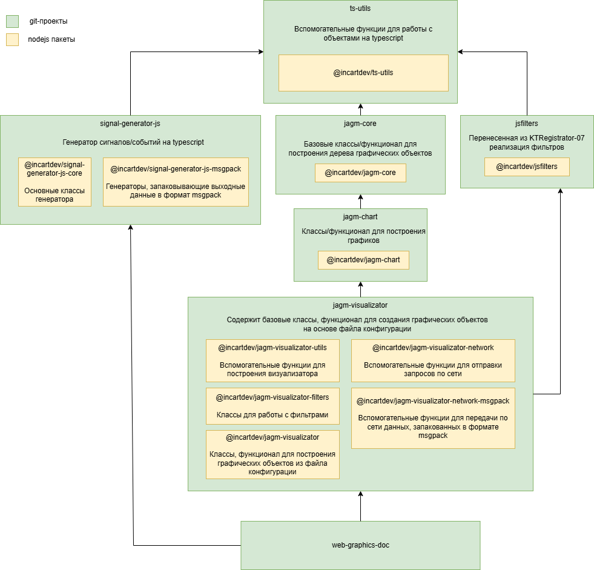
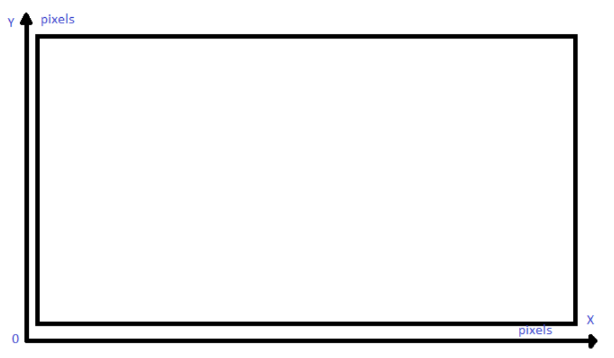

# Общие сведения
Графическая библиотека предназначена для отображения динамических или статических графиков.

## Терминология


  Графическая библиотека &mdash; это комплексный продукт, собственным набором устоявшихся терминов. Правильная трактовка терминов упростит понимание изложенных материалов. 



### Прикладные термины
* `Offline(статический)` &mdash; режим работы графика, при котором на данные на графике статичны.
* `Online(динамический)` &mdash; режим работы графика, при котором данные на графике обновляются в реальном времени.
* `Signal(сигнал)` &mdash; данные, отображающиеся на графике.
* `Source(источник)` &mdash; структура данных, содержащая один или несколько каналов. Источник определяет ресурс, предоставляющий данные. Например, два разных API.
* `Channel(канал)` &mdash; структура данных, содержащая один или несколько вариантов отображения сигналов. Канал логически разделяет сигналы различных типов. Например, сигнал ЭКГ от сигнала ЭЭГ.
* `Variant(вариант)` &mdash; структура данных, определяющая группу сигналов, которые возможно отобразить на графике. Например, группа из 3 ЭКГ-отведений и группа из 6 ЭКГ-отведений.

### Фундаментальные термины
* `Графическое полотно` &mdash; графическим полотном принято называть html-элемент `<canvas>`.
* `Контейнер` &mdash; графический объект, определяющий правила размещениея, положение и размер отображения графика на графическом полотне.
* `График` &mdash; графический объект, отображающий сигнал.

## Архитектура
В основе библиотеки лежит технология [WebGl](https://developer.mozilla.org/ru/docs/Web/API/WebGL_API), отвечающая за визуализацию двухмерной графики в HTML элементе `<canvas>`.

Графическая библиотека разделена на 11 npm-пакетов, которые в общей сложности составляют три модуля:
* `jagm-core` &mdash; предоставляет функции и соответствующие интерфейсы для создания контейнеров.
* `jagm-chart` &mdash; предоставляет функции и соответствующие интерфейсы для создания базового графика и некоторых графических элементов. 
* `jagm-visualizator` &mdash; предоставляет функции и соответствующие интерфейсы для создания графиков различных типов и графических элементов.

## Система координат
Начало координат графического полотна, в отличии от системы координат браузера, располагается в левом нижнем углу.
Соответственно, значения оси `x` увеличиваются при движении вправо, а оси `y` &mdash; вверх.

