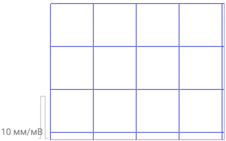

# Графические элементы

Графические элементы &mdash; дополнительные графические объекты, дополняющие или изменяющие внешний вид графика и его функциональность.

Каждый графический элемент имеет следующие свойства:

```json
{
    "name": "", // Название элемента
    "sector": "", // Расположения элемента
    "layerZ": -1, // Z-индекс элемента
    "settings": {} // Конфигурация элемента
}
```



  В общем случае свойства конфигурации различаются для каждого элемента.





  Подробнее о возможных расположениях элементов можно прочитать в статье [Графики](graphs).



Графические элементы можно разделить на две группы:
* [Общие](#общие-элементы) &mdash; применимы ко всем типам графиков.
* [Частные](#частные-элементы) &mdash; применимы к определенным типам графиков.
 
## Общие элементы

### border
Элемент `border` позволяет задавать цвет границы контейнера.

Пример определения элемента.
```json
{
    "name": "border",
    "sector": "",
    "layerZ": -1,
    "settings": { "view": "webgl", "color": "#3F48CC" }
}
```
| Название | Тип | Значение поумолчанию | Описание |
| :---: | :---: | :---: | --- |
| `view` | **string** | webgl | Вид отрисовки элемента. Возможные значения: `webgl`, `svg`. |
| `color` | **string** | #C8C8C8 | Цвет элемента. |

Пример:

<div style={{ display: 'flex', justifyContent: 'space-around' }}>
  
  
</div>

### grid
Элемент `grid` позволяет задавать формат сетки, отображаемой на графическом полотне.

Пример определения элемента.
```json
{
    "name": "grid",
    "sector": "central",
    "layerZ": -1,
    "settings": {
        "view": "webgl-single",
        "color": "#3F48CC",
        "cellSize_mm": { "width": 10, "height": 10 }
    }
}
```
| Название | Тип | Значение поумолчанию | Описание |
| :---: | :---: | :---: | --- |
| `view` | **string** | webgl-single | Устанавливает вид отрисовки элемента. Возможные значения: `webgl-single`, `webgl-double`, `svg-single`, `svg-double`.|
| `color` | **string** | #C8C8C8 | Устанавливает цвет элемента. |
| `cellSize_mm` | **object** | "cellSize_mm": \{ "width": 10, "height": 10 \} | Устанавливает размер ячеек сетки. |

При установке `view` значений webgl-double или svg-double конфигурация принимает следующий вид:
```json
{
    "name": "grid",
    "sector": "central",
    "layerZ": -1,
    "settings": {
        "view": "webgl-single",
        "color": "#3F48CC",
        "majorCell": {
          "size_mm": { "width": 10, "height": 10 },
          "lineWidth_mm": 0.3
        },
        "minorCell": {
          "size_mm": { "width": 1, "height": 1 },
          "lineWidth_mm": 0.1
        }
    }
}
```
| Название | Тип | Значение поумолчанию | Описание |
| :---: | :---: | :---: | --- |
| `majorCell` | **object** | "majorCell": \{ "size_mm": \{ "width": 10, "height": 10 \}, "lineWidth_mm": 0.3 \}, | Устанавливает размер главной ячейки.|
| `majorCell` | **object** | "majorCell": \{ "size_mm": \{ "width": 1, "height": 1 \}, "lineWidth_mm": 0.3 \}, | Устанавливает размер внутренней ячейки.|
| `lineWidth_mm` | **number** | &mdash; | Устанавливает ширину границы ячейки. |

Пример:

<div style={{ display: 'flex', justifyContent: 'space-around' }}>
  
  
</div>

### meander
Элемент `meander` позволяет отображать глиф меандра на графическом полотне.

Пример определения элемента:
```json
{
    "name": "meander",
    "sector": "central",
    "layerZ": -1,
    "settings": {
        "title": "",
        "isVisible": "",
        "channelUnit": "с",
        "unit": "мм",
        "label": { "fontSize": "", "fontFamily": "", "color": "" },
        "location": { "x": "", "y": "" },
        "size": { "width": "", "widthTop": "" },
        "style": { "color": "", "lineWidth": "" }
    }
}
```
| Название | Тип | Значение поумолчанию | Описание |
| :---: | :---: | :---: | --- |
| `title` | **string** | &mdash; | Название элемента. |
| `isVisible` | **object** | *ОБЯЗАТЕЛЬНОЕ* | Устанавливает видимость элемента. |
| `label` | **object** | &mdash; | Устанавливает стиль текста элемента. |
| `location` | **object** | &mdash; | Устанавливает позицию левого нижнего края элемента внутри графического контейнера. |
| `size` | **object** | &mdash; | Устанавливает стиль текста элемента. |
| `style` | **object** | &mdash; | Устанавливает стиль текста элемента. |

Свойства `unit` и `channelUnit` используются для отображения калибровочного значения графика. 
Свойство `unit` задаёт масштаб отклонения регистрирующей системы, т.е. определяет, сколько единиц измерения по оси Y соответствует определённой величине отклонения на графике. 
Свойство `channelUnit` указывает амплитуду электрического импульса в физических единицах, соответствующую одному делению на графике. 
Калибровка представляется в виде отношения `unit/channelUnit`, указываемого рядом с графиком.

#### label

| Название | Тип | Значение поумолчанию | Описание |
| :---: | :---: | :---: | --- |
| `fontSize` | **string** | #808080 | Устанавливает размер шрифта. |
| `fontFamily` | **string** | Roboto | Устанавливает шрифт. |
| `color` | **string** | 12 | Устанавливает цвет элемента. |

#### location

| Название | Тип | Значение поумолчанию | Описание |
| :---: | :---: | :---: | --- |
| `x` | **string** | 4 px | Позиция по оси X. |
| `y` | **string** | 0 px | Позиция по оси Y. |

#### size

| Название | Тип | Значение поумолчанию | Описание |
| :---: | :---: | :---: | --- |
| `width` | **number** | 12 | Устанавливает длительность паузы глифа меандра. |
| `widthTop` | **number** | 6 | Устанавливает длительности импульса глифа меандра. |



  Для корректного отображения глифа значение `width` должно быть больше `widthTop`.



#### style

| Название | Тип | Значение поумолчанию | Описание |
| :---: | :---: | :---: | --- |
| `color` | **string** | #C4C4C4 | Устанавливает цвет элемента. |
| `widthTop` | **number** | ? | Устанавливает ширину линии отрисовки глифа. |

Пример:



<!-- ### signals
Элемент `signals` позволяет управлять свойствами осей.

Пример определения элемента:
```json
{
    "name": "signals",
    "settings": {
        "scaleX": {
            "values": [1, 2, 5, 10, 25, 50],
            "index": 3,
            "distanceUnit": 0,
            "timeUnit": 1
        },
        "scaleY": {
            "values": [2.5, 5, 10, 20, 40],
            "index": 2,
            "distanceUnit": 0,
            "valueUnit": 2
        },
    // "unitsXtoMmConvertKoef": "",
    // "unitsYtoMmConvertKoef": "",
    // "filters": "",
    // "defaultFilters": "",
    // "viewScale": "",
    // "labels": "",
    }
}
```
* `scaleX` &mdash; устанавливает свойства оси X.
  - `values` &mdash; устанавливает массив значений масштаба оси.
  - `index` &mdash; устанавливает значение масштаба оси. Значение данного свойства &mdash; индекс масштабирующей единицы из массива `values`.
  - `distanceUnit` &mdash; устанавливает масштаб по оси X, определяя, сколько единиц времени соответствует одному делению на графике. Не меняет графическое полотно, но задействуется при конфигурировании органов управления
  графическим полотном.
  - `timeUnit` &mdash; устанавливает временной интервал, соответствующий одному делению по оси X. Не меняет графическое полотно, но задействуется при конфигурировании органов управления
  графическим полотном.
* `scaleY` &mdash; устанавливает свойства оси Y.
  - `values` &mdash; устанавливает массив значений масштаба оси.
  - `index` &mdash; устанавливает значение масштаба оси. Значение данного свойства &mdash; индекс масштабирующей единицы из массива `values`.
  - `distanceUnit` &mdash; устанавливает масштаб отклонения регистрирующей системы. Не меняет графическое полотно, но задействуется при конфигурировании органов управления
  графическим полотном.
  - `valueUnit` &mdash; устанавливает амплитуду электрического импульса в физических единицах. Не меняет графическое полотно, но задействуется при конфигурировании органов управления
  графическим полотном. -->

## Частные элементы

### cursor
Элемент `cursor` позволяет перемещаться по графику.

Пример определения элемента:
```json
{
    "name": "cursor",
    "sector": "central",
    "layerZ": 1,
    "settings": {
        "color": "#66ff00",
        "startPosition_ms": 0,
        "leftPanelWidth": "70 px",
        "touchLineAreaWidth": 8,
        "leftMinSpaceToAnother": 4,
        "rightMinSpaceToAnother": 4
    }
},
```

| Название | Тип | Значение поумолчанию | Описание |
| :---: | :---: | :---: | --- |
| `color` | **string** | [0, 0, 0, 255] | Устанавливает цвет элемента. |
| `startPosition_ms` | **number** | 0 | Устанавливает значение начальной позиции курсора. |
| `touchLineAreaWidth` | **number** | 8 | Устанавливает ширину интерактивной области курсора. |
| `leftMinSpaceToAnother` | **number** | 0 | Устанавливает минимальное расстояние до другого курсора с левой стороны.. |
| `rightMinSpaceToAnother` | **number** | 0 | Устанавливает минимальное расстояние до другого курсора с правой стороны. |



  `leftMinSpaceToAnother` и `rightMinSpaceToAnother` должны согласовываться с `touchLineAreaWidth` и не позволять двум интерактивным областям накладываться друг на друга.



Пример:

| <video autoplay loop muted src="../../_assets/graph_elements_cursor.webm" width="100%" height="100%"/> |
|:-:|

### leadRay
Элемент `leadRay` позволяет конфигурировать границу отрисовки графика.

Пример определения элемента:
```json
{
    "name": "leadRay",
    "sector": "central",
    "layerZ": 1,
    "settings": { "color": "#66ff00", "synchronized": true }
},
```

| Название | Тип | Значение поумолчанию | Описание |
| :---: | :---: | :---: | --- |
| `color` | **string** | [0, 0, 0, 1] | Устанавливает цвет элемента. |
| `synchronized` | **boolean** | true | Устанавливает синхронизацию границы отрисовки. |



  [Пример](/examples/async_speed) несинхронизированной границы




### measurer
Элемент `measurer` позволяет измерять и сравнивать характеристики части графика, находящегося в области данного элемента.

Пример определения элемента:
```json
{
    "name": "measurer",
    "sector": "central",
    "layerZ": 1,
    "settings": {
        "leftPanelWidth": "200 px",
        "startPosition_ms": 0,
        "startWidth_ms": 2000,
        "leftLineColor": "#00ff00",
        "rightLineColor": "#0000ff",
        "focusedAreaColor": "#28bbff",
        "intermediateAreaColor": "#00000011",
        "commonLabelColor": "#3F48CC",
        "minLinesSpace": 5,
        "touchLineAreaWidth": 8,
        "leftMinSpaceToAnother": 4,
        "rightMinSpaceToAnother": 4
    }
}
```

| Название | Тип | Значение поумолчанию | Описание |
| :---: | :---: | :---: | --- |
| `startPosition_ms` | **number** | 0 | Устанавливает значение начальной позиции курсора. |
| `startWidth_ms` | **number** | 2000 | Устанавливает начальное значение ширины измерителя. |
| `leftLineColor` | **Array\<number\>** | [0, 0, 0, 1] | Устанавливает цвет левой границы измерителя. |
| `rightLineColor` | **Array\<number\>** | [0, 0, 0, 1] | Устанавливает цвет правой границы измерителя. |
| `focusedAreaColor` | **Array\<number\>** | [0, 0, 0, 1] | Устанавливает цвет границы при фокусе. |
| `intermediateAreaColor` | **Array\<number\>** | [0, 0, 0, 1] | Устанавливает цвет области, выделяемой измерителем. |
| `commonLabelColor` | **Array\<number\>** | [0, 0, 0, 1] | Устанавливает цвет расчётных значений характеристик, отображаемых на легенде. |
| `minLinesSpace` | **number** | 0 | Устанавливает минимальное расстояние между границами измерителя. |
| `touchLineAreaWidth` | **number** | 8 | Устанавливает ширину интерактивной области курсора. |
| `leftMinSpaceToAnother` | **number** | 0 | Устанавливает минимальное расстояние до другого курсора с левой стороны.. |
| `rightMinSpaceToAnother` | **number** | 0 | Устанавливает минимальное расстояние до другого курсора с правой стороны. |

Пример:

> Пока нет

## Элементы легенды

### signalLabels
Элемент `signalLabels` позволяет отображать легенду графического полотна.

Пример определение элемента:
```json
{
    "name": "signalLabels",
    "sector": "leftCentral",
    "settings": {
        "labels": [
            {
                "id": 0,
                "text": "Ecg0",
                "y": "0 px",
                "linkedPosition": true,
                "color": "#026ce5",
                "id_signal": 0
            }
        ]
    }
},
```
| Название | Тип | Значение поумолчанию | Описание |
| :---: | :---: | :---: | --- |
| `labels` | **number** | 0 | Устанавливает массив элементов, составляющих легенду. |

#### labels

| Название | Тип | Значение поумолчанию | Описание |
| :---: | :---: | :---: | --- |
| `id` | **number** | Поле задаётся неявно и равно индексу в массиве `labels` | Устанавливает уникальный идентификатор элемента легенды. |
| `text` | **string** | "" | Устанавливает текст элемента легенды. |
| `y` | **string** | 0 px | Устанавливает положение элемента легенды. |
| `linkedPosition` | **boolean** | true | Устанавливает связь позиции легенды с изолинией соответствующего графика. Если `true` &mdash; легенда отрисовывается на соответствующей изолинии, `y` отсчитывается от изолинии. Если `false` &mdash; легенда отрисовывается на нижней части контейнера легенды, `y` отсчитывается от нижней части контейнера легенды. |
| `color` | **Array\<number\>** | [0, 0, 0, 1] | Устанавливает цвет элемента. |
| `id_signal` | **number** | Поле задаётся неявно и равно индексу в массиве `id_signal` | Устанавливает идентификатор сигнала, описанного в объекте data, к которому привязывается конфигурируемый элемент легенды. |

Пример:
> Пока нет

### meanValueLabels
Элемент `meanValueLabels` позволяет отображать расчётные характеристики на легенде.

Пример определение элемента:
```json
{
    "type": "graphic",
    "name": "meanValueLabels",
    "place": "leftCentral",
    "settings": [
        {
            "id": 0,
            "linkedPosition": true,
            "y": "-14 px",
            "color": [0, 153, 153, 255],
            "id_signal": 0
        }
    ]
}
```

| Название | Тип | Значение поумолчанию | Описание |
| :---: | :---: | :---: | --- |
| `id` | **number** | Поле задаётся неявно и равно индексу в массиве `labels` | Устанавливает уникальный идентификатор элемента легенды. |
| `text` | **string** | "" | Устанавливает текст элемента легенды. |
| `y` | **string** | 0 px | Устанавливает положение элемента легенды. |
| `linkedPosition` | **boolean** | true | Устанавливает связь позиции легенды с изолинией соответствующего графика. Если `true` &mdash; легенда отрисовывается на соответствующей изолинии, `y` отсчитывается от изолинии. Если `false` &mdash; легенда отрисовывается на нижней части контейнера легенды, `y` отсчитывается от нижней части контейнера легенды. |
| `color` | **Array\<number\>** | [0, 0, 0, 1] | Устанавливает цвет элемента. |
| `id_signal` | **number** | Поле задаётся неявно и равно индексу в массиве `id_signal` | Устанавливает идентификатор сигнала, описанного в объекте data, к которому привязывается конфигурируемый элемент легенды. |

Пример:

> Пока нет