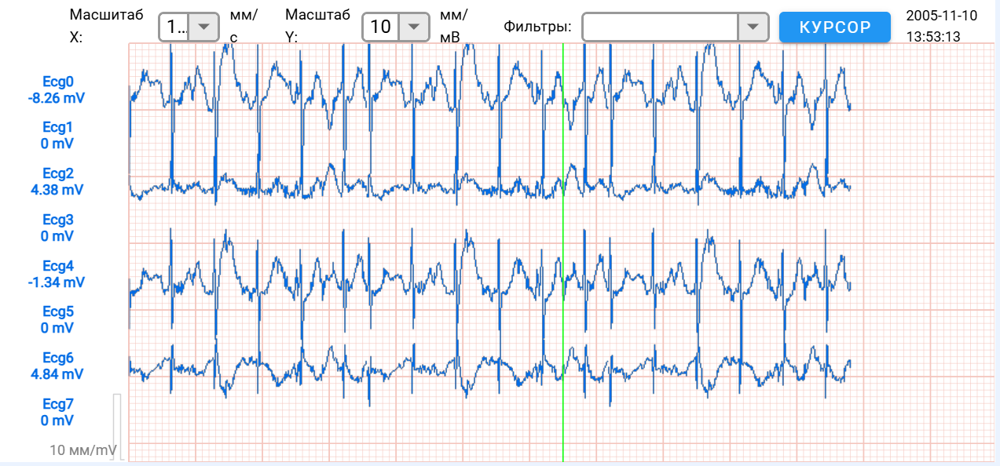
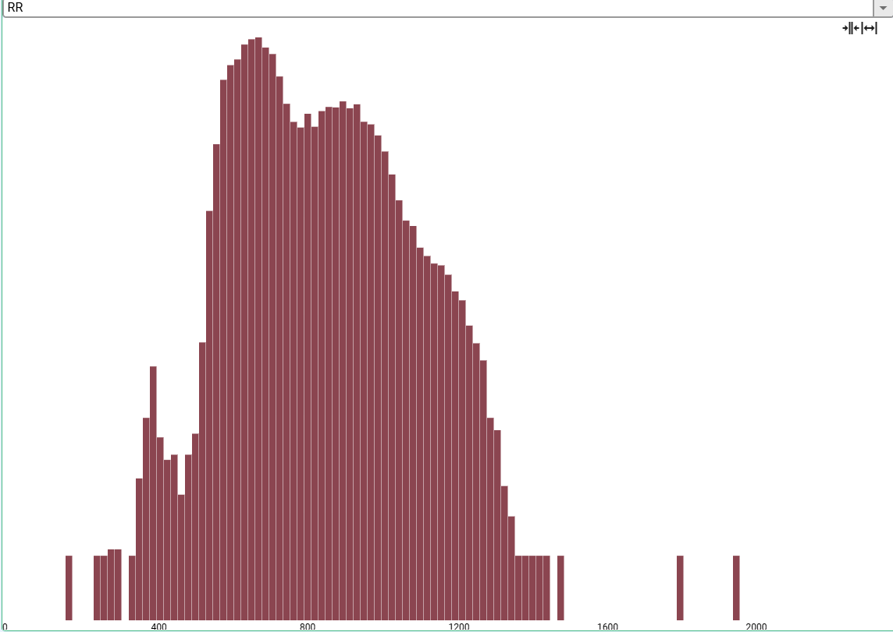
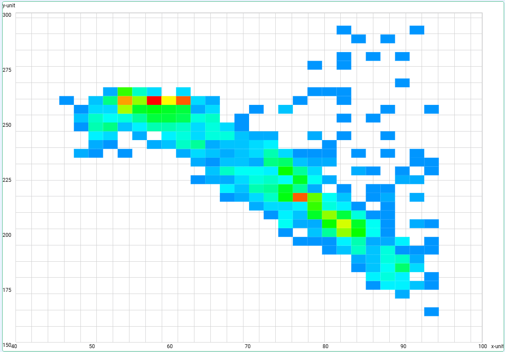
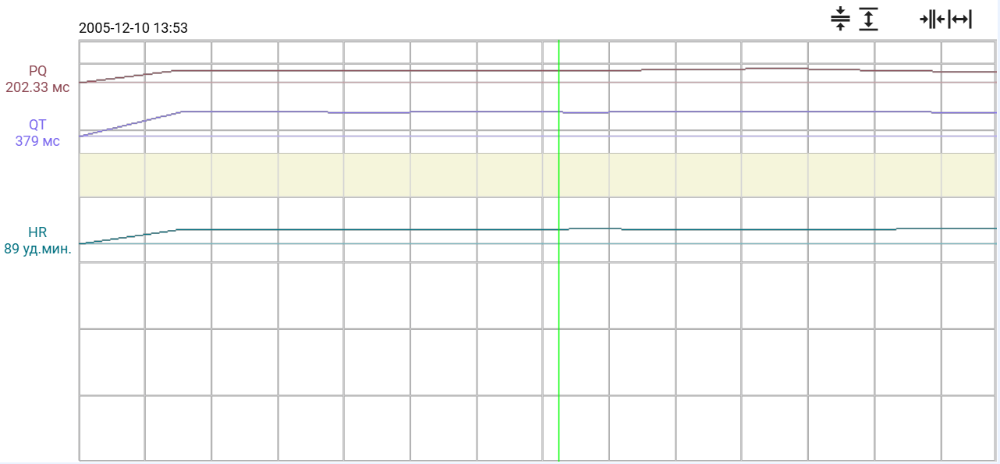

# Графики

В графической библиотеке представлены 3 вида графиков \( по характеру поступаемых данных\):
* [Online-графики](#online-графики) &mdash; данные поступают в Online режиме (большая частота, небольшой объем, регулярынй характер).
  - [plot:online:base](#plotonlinebase)
  - [plot:online:rhythm](#plotonlinerhythm)
* [Offline-графики](#offline-графики) &mdash; данные поступают в Offline режиме (большой объем, произвольный момент веремени).
  - [plot:offline:base](#plotofflinebase)
  - [plot:offline:rhythm](#plotofflinerhythm)
  - [plot:offline:hist](#plotofflinehist)
  - [plot:offline:scatter](#plotofflinescatter)
  - [plot:offline:trend](#plotofflinetrend)
* [Pauseable-графики](#pauseable-графики) &mdash; данные могут поступать в Offline и Online режимах.
  - [plot:pauseable:base](#plotpauseablebase)
  - [plot:pauseable:rhythm](#plotpauseablerhythm)


## Online-графики
`Online-графики` позволяют отображать сигнал, обновляемые в реальном времени.

### plot:online:base
Для применения данного графика свойство `type` объекта-графика необходимо указать следующим образом:
```json
// Внутри описания объекта view
{
    "type": "plot:online:base"
}
```
| <video autoplay loop muted src="../../_assets/plotonlinebase.webm" width="100%" height="100%"/> |
|:-:|



  Пример [plot:online:base](/examples/simple).



### plot:online:rhythm
Для применения данного графика свойство `type` объекта-графика необходимо указать следующим образом:
```json
// Внутри описания объекта view
{
    "type": "plot:online:rhythm"
}
```



  Пример [plot:online:rhythm](/examples/simple)



## Offline-графики
`Offline-графики` позволяют отображать статичные сигналы.

### plot:offline:base
Для применения данного графика свойство `type` объекта-графика необходимо указать следующим образом:
```json
// Внутри описания объекта view
{
    "type": "plot:offline:base"
}
```





  Пример [plot:offline:base](/examples/sync_ecg_trend_plot).



### plot:offline:rhythm
Для применения данного графика свойство `type` объекта-графика необходимо указать следующим образом:
```json
// Внутри описания объекта view
{
    "type": "plot:offline:rhythm"
}
```



  Пример [plot:offline:rhythm](/examples/simple).



### plot:offline:hist
Для применения данного графика свойство `type` объекта-графика необходимо указать следующим образом:
```json
// Внутри описания объекта view
{
    "type": "plot:offline:hist"
}
```





  Пример [plot:offline:hist](/examples/hist_plot).



### plot:offline:scatter
Для применения данного графика свойство `type` объекта-графика необходимо указать следующим образом:
```json
// Внутри описания объекта view
{
    "type": "plot:offline:scatter"
}
```





  Пример [plot:offline:scatter](/examples/scatter_plot).



### plot:offline:trend
Для применения данного графика свойство `type` объекта-графика необходимо указать следующим образом:
```json
// Внутри описания объекта view
{
    "type": "plot:offline:trend"
}
```





  Пример [plot:offline:trend](/examples/trend_plot).



## Pauseable-графики
`Pauseable-графики` позволяют отображать сигнал, обновляемые в реальном времени. Имеют возможность остановить обновление сигнала для работы с ним, как со статичным.

### plot:pauseable:base
Для применения данного графика свойство `type` объекта-графика необходимо указать следующим образом:
```json
// Внутри описания объекта view
{
    "type": "plot:pauseable:base"
}
```



  Пример [plot:pauseable:base](/examples/trend_plot).



### plot:pauseable:rhythm
Для применения данного графика свойство `type` объекта-графика необходимо указать следующим образом:
```json
// Внутри описания объекта view
{
    "type": "plot:pauseable:rhythm"
}
```



  Пример [plot:pauseable:rhythm](/examples/trend_plot).


