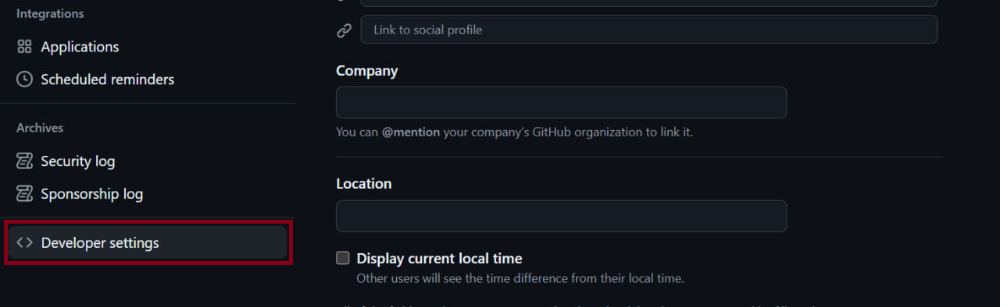
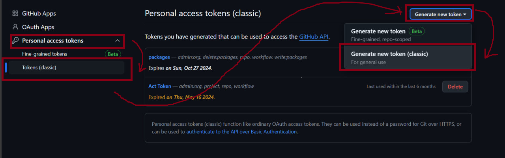
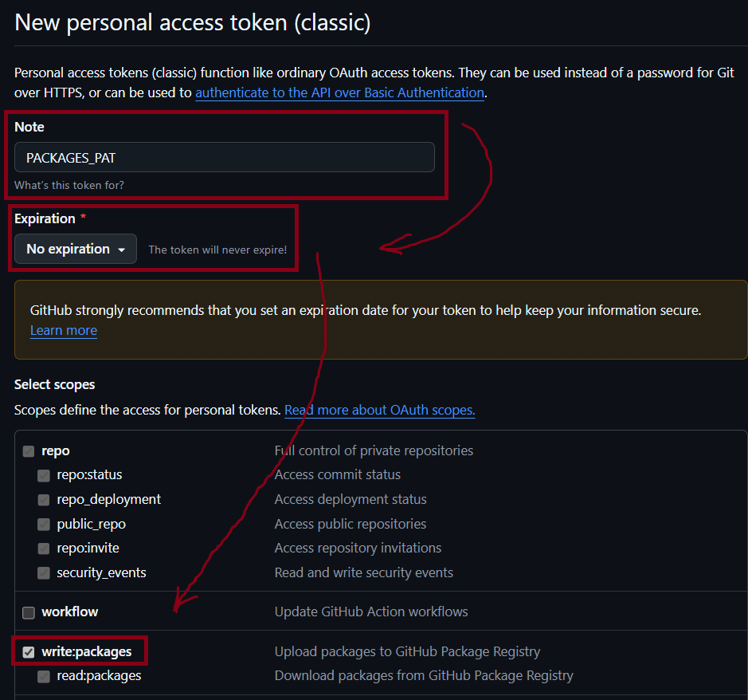
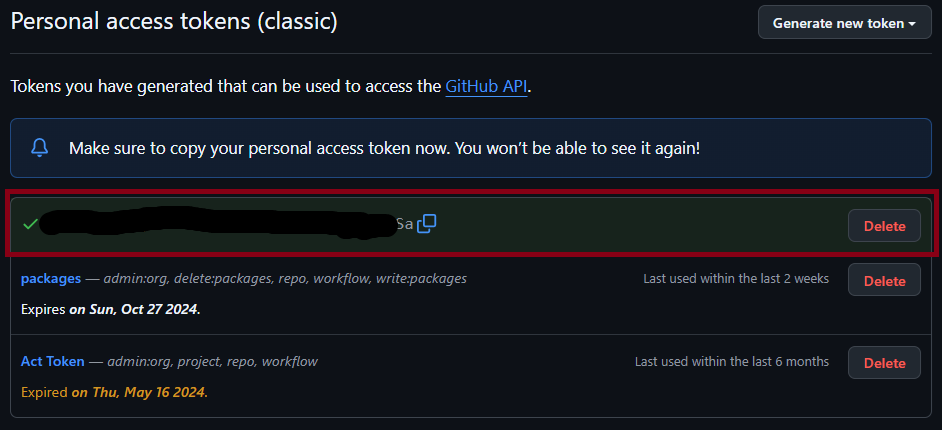

# Установка



  Для установки потребуется доступ к репозиторию организации и настроенное ssh-подключение к GitHub. О том, как настроить подключение, можно прочитать [здесь](https://docs.github.com/ru/authentication/connecting-to-github-with-ssh/generating-a-new-ssh-key-and-adding-it-to-the-ssh-agent).



Для установки и обновления графической библиотеки необходимо добавить в корневую директорию проекта файл `.npmrc`. Он настраивает работу npm с реестром npm-пакетов github.

В файл необходимо добавить следующие сторки:
```text
//npm.pkg.github.com/:_authToken=<GITHUB_TOKEN>
@incartdev:registry=https://npm.pkg.github.com/
```
Вместо \<GITHUB_TOKEN\> необходимо вписать свой собственный PAT-токен.
## Получения PAT-токена
Чтобы сгенерировать свой токен необходимо:
1. Открыть настройки GitHub.
2. В настройках найти пунк Developer settings.

3. В пункте Developer settings пройти по следующем пути: personal access tokens -> tokens(classic) -> generate new token -> generate new token (classic).

4. Авторизироваться, если GitHub попросит.
5. В открывшемся меню выбрать имя для токена, например, PACKAGES_PAT, выбрать срок действия токена (рекомендуем выбрать или бессрочно, или сроком на год), выставить разрешение `write:packages`.

6. В конце страницы нажать Generate token.
7. **ОБЯЗАТЕЛЬНОЕ** скопируйте получившийся ключ. Вы не сможете ещё раз его посмотреть. Возможно либо создать новый, либо перегенерировать старый.

8. Скопируйте сгенерированный токен в файл `.npmrc`. У вас должно получиться следующее:
```text
//npm.pkg.github.com/:_authToken=abc_QwErtyUiOp...
@incartdev:registry=https://npm.pkg.github.com/
```


  Обязательно следует добавть файл .npmrc в .gitignore.


## Подключение графической библиотеки
Графическая библиотека подключается в виде пакета с помощью команды **npm install**:
```sh
$ npm install @incartdev/jagm-visualizator
```
Версии релизов можно посмотреть [здесь](https://github.com/IncartDev/jagm-visualizator/pkgs/npm/jagm-visualizator/versions).